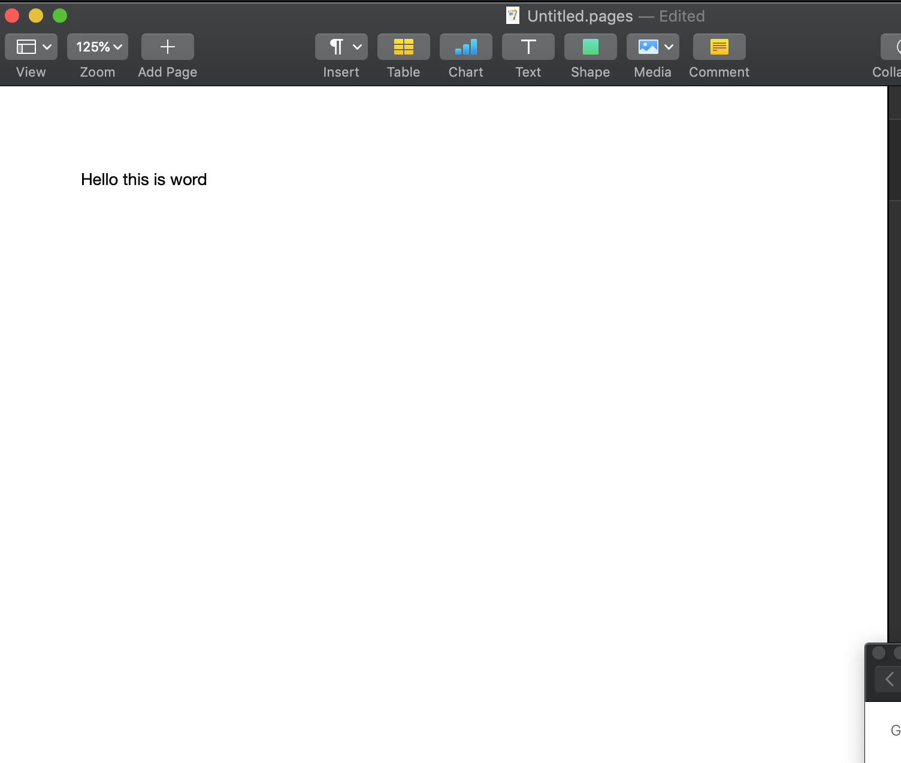
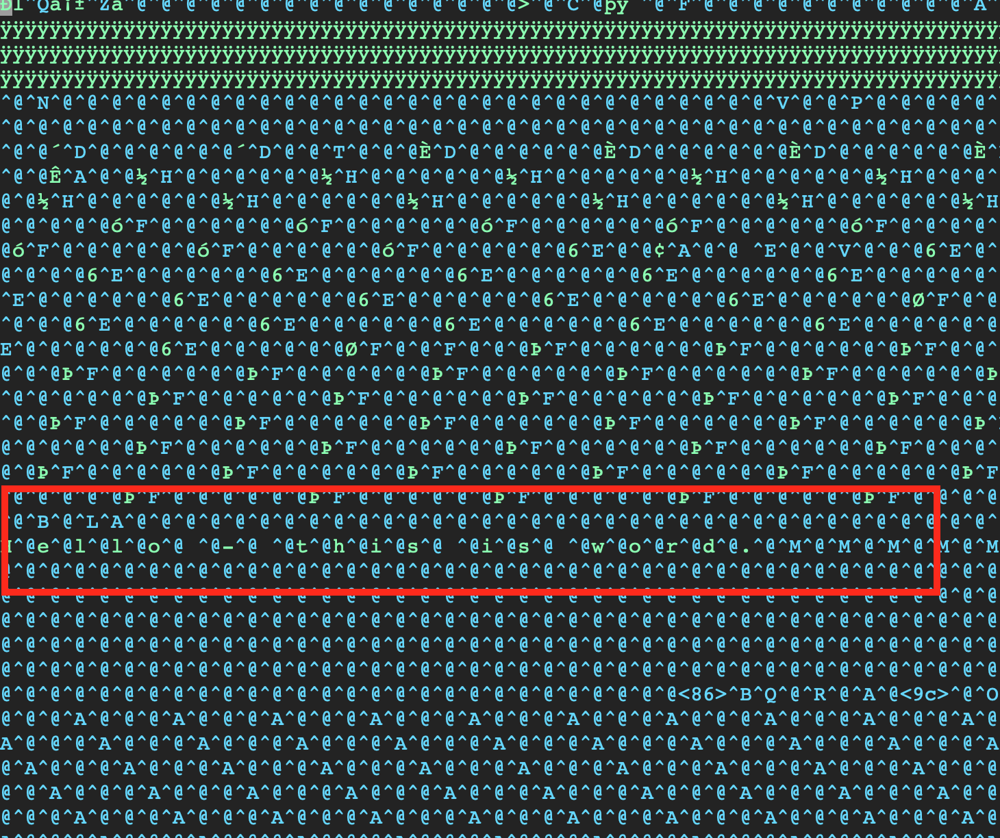
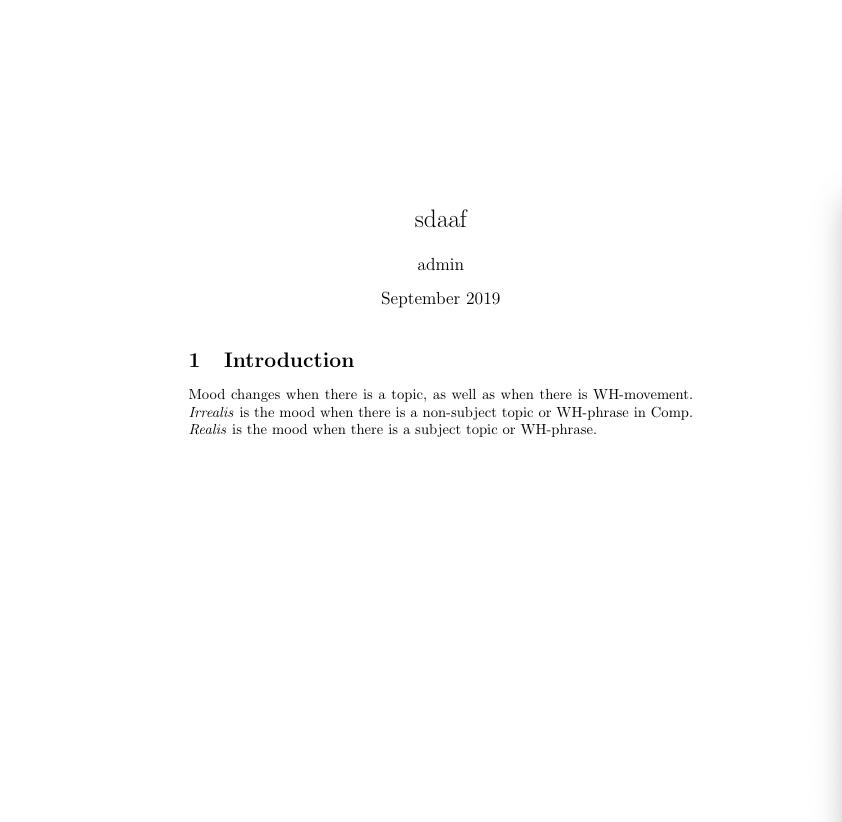
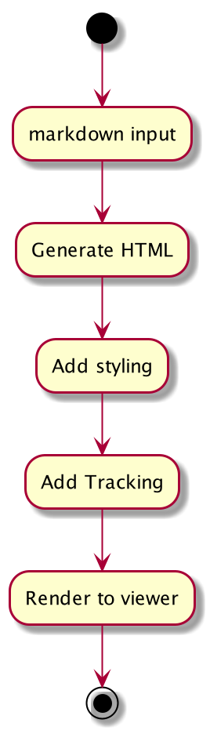
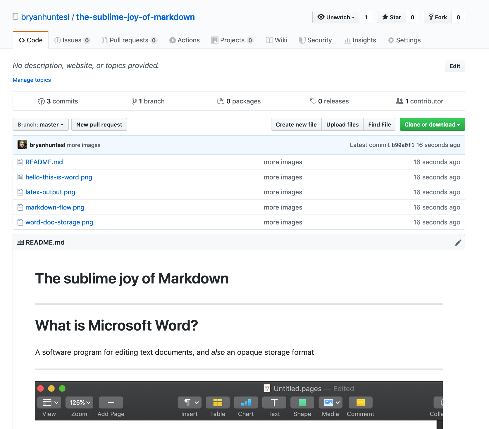

# The sublime joy of Markdown

---

# What is Microsoft Word? 

A software program for editing text documents, and _also_ an opaque storage format

---




---

# What is Latex?

A software for expressing the structure and content of documents and the positioning of elements within the rendered output of the document.

---

```
\documentclass{article}
\usepackage[utf8]{inputenc}

\title{sdaaf}
\author{admin }
\date{September 2019}

\begin{document}

\maketitle

\section{Introduction}

Mood changes when there is a topic, as well as when
there is WH-movement.  \emph{Irrealis} is the mood when
there is a non-subject topic or WH-phrase in Comp.
\emph{Realis} is the mood when there is a subject topic
or WH-phrase.

\end{document}

\end{document}

```



> [overleaf.com](https://www.overleaf.com)

---

# What is HTML? 

_Hypertext Markup Language_ is the standard markup language for documents designed to be displayed in a web browser. 
It can be assisted by technologies such as _Cascading Style Sheets_ and scripting languages such as _JavaScript_. [Wikipedia]

---

# But really, what is HTML?

```html
<h1>What is HTML?</h1>
<p><br /><em>Hypertext Markup Language is the standard markup language 
for documents designed to be displayed in a web browser. 
It can be assisted by technologies such as 
<strong>Cascading Style Sheets</strong> and scripting languages 
such as <strong>JavaScript</strong>. [Wikipedia]</em></p>
```

---

# And what is markdown ?

_Hypertext Markup Language_ is the standard markup language for 
documents designed to be displayed in a web browser.
It can be assisted by technologies such as _Cascading Style Sheets_ 
and scripting languages such as _JavaScript_. [Wikipedia]


```markdown
# And what is markdown ?

_Hypertext Markup Language_ is the standard markup language for 
documents designed to be displayed in a web browser.
It can be assisted by technologies such as _Cascading Style Sheets_ 
and scripting languages such as _JavaScript_. [Wikipedia]

```

---

# What supports markdown ?

* Every text editor on the planet
* Github natively
* Github sites (Jekyll) natively
* [https://stackedit.io](https://stackedit.io)
* [https://dillinger.io/](https://dillinger.io/) (try it out)

---

# The workflow



---

# Advantages 

* Can be version controlled
* Comparability (a program can show the difference of any two files)
* Syntax is oh so simple (see the source of this presentation)

---

# Disadvantages

* Lacks colaborative editing like google docs 
* Requires learning the syntax

--- 

# This presentation / This website




* https://bryanhuntesl.github.io/the-sublime-joy-of-markdown/
* https://bryanhuntesl.github.io/the-sublime-joy-of-markdown/

